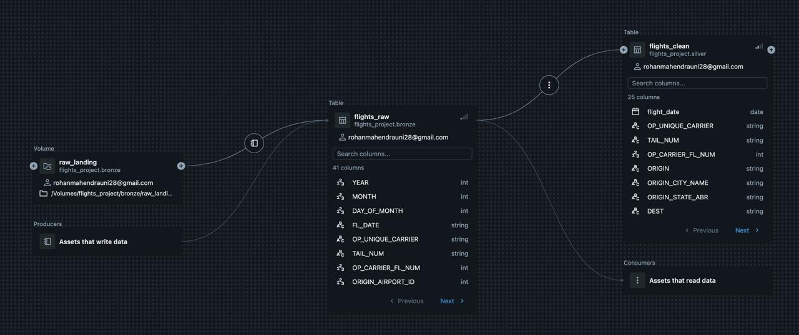
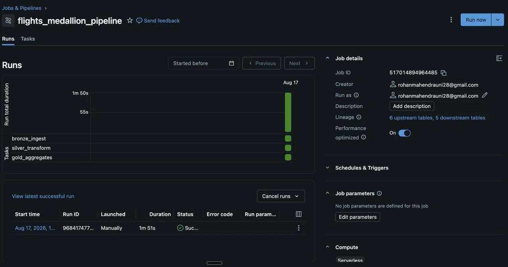
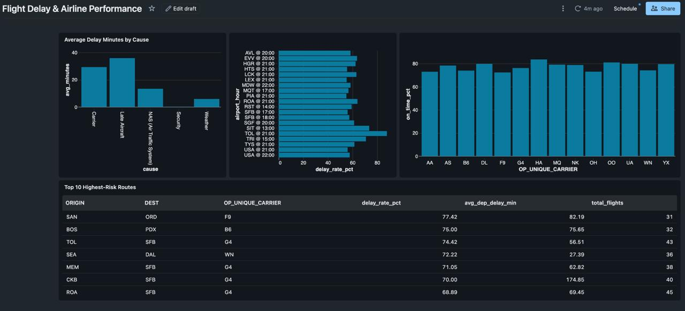

# Flight Delay & Airline Performance Analytics — Databricks Lakehouse

An end-to-end data engineering pipeline on Databricks that ingests, cleans, and analyzes 2.3M+ US domestic flight records to surface airline reliability, delay risk, and cascading delay patterns — built on a medallion (bronze/silver/gold) lakehouse architecture with Unity Catalog governance and automated orchestration.

---

## Architecture

```
BTS Flight Data (CSV, monthly)
        │
        ▼
┌─────────────────┐      ┌──────────────────┐      ┌──────────────────┐
│     BRONZE       │      │      SILVER       │      │       GOLD        │
│  Raw ingest       │ ──▶  │  Cleaned + typed   │ ──▶  │  Business aggre-   │
│  Autoloader        │     │  Dedup, status      │     │  gates, dashboard-  │
│  Schema evolution   │     │  flags, derived      │     │  ready tables        │
└─────────────────┘      └──────────────────┘      └──────────────────┘
        │                          │                          │
        └──────────────────────────┴──────────────────────────┘
                                    │
                    Unity Catalog (governance) +
                Databricks Workflows (orchestration)
                                    │
                                    ▼
                     Databricks SQL Dashboard
```

**Layers:**
- **Bronze** (`flights_project.bronze.flights_raw`) — raw CSV ingestion via Autoloader with schema evolution, lineage columns (`_ingested_at`, `_source_file`)
- **Silver** (`flights_project.silver.flights_clean`) — typed columns, deduplicated, explicit `flight_status` (ON_TIME / DELAYED / CANCELLED / DIVERTED), derived time features
- **Gold** (`flights_project.gold.*`) — four business-ready tables: carrier performance, airport/hour delay risk, delay-cause breakdown, route-level risk

---

## Tech Stack

| Layer | Tools |
|---|---|
| Ingestion | Databricks Autoloader (`cloudFiles`), Unity Catalog Volumes |
| Storage/Processing | Delta Lake, PySpark, Spark SQL |
| Governance | Unity Catalog (lineage, access grants, table/column documentation) |
| Orchestration | Databricks Workflows (multi-task job with dependencies) |
| Consumption | Databricks SQL / Lakeview Dashboard |
| ML | Spark MLlib (Logistic Regression), MLflow tracking |
| Compute | Databricks Free Edition (serverless) |

---

## Dataset

Source: [BTS TranStats — Airline On-Time Performance Data](https://www.transtats.bts.gov/ontime/) (Reporting Carrier On-Time Performance, 1987–present)

- **Scope:** 4 months across seasons — January, April, July, October 2025 (~2.36M rows)
- **Fields:** flight identifiers, origin/destination, scheduled vs. actual departure/arrival times, cancellations/diversions, delay-cause breakdown (carrier, weather, NAS, security, late aircraft)

---

## Key Results

| Metric | Value |
|---|---|
| Total flights processed | 2,360,969 |
| On-time rate | 77.0% |
| Delayed (15+ min) | 21.0% |
| Cancelled | 1.7% |
| Diverted | 0.3% |
| Top on-time carrier | Hawaiian Airlines (83.6%) |
| Dominant delay cause | Late Aircraft (35.8 min avg) — cascading delays outweigh weather (5.9 min avg) |
| Pipeline run time (bronze → gold) | 1m 51s |

---

## Governance

Built with Unity Catalog as a first-class concern, not an afterthought:

- **Lineage** — automatic column and table-level lineage tracked across bronze → silver → gold, viewable in Catalog Explorer
- **Access control** — read-only grant on the `gold` schema, restricting bronze/silver to engineering access only
- **Documentation** — every table carries a `COMMENT` describing its purpose, refresh source, and intended consumers
- **Governed file access** — raw files land in Unity Catalog Volumes rather than ungoverned cloud paths; ingestion code uses `_metadata.file_path` rather than deprecated file-system functions blocked under UC



---

## Orchestration

Three notebooks chained into a single Databricks Workflow with explicit task dependencies:

`bronze_ingest → silver_transform → gold_aggregates`



---

## Dashboard

Four visuals built on the gold layer:

1. **On-time performance by carrier** — ranks all 14 carriers by reliability
2. **Delay risk by airport/hour** — surfaces the riskiest departure windows
3. **Delay cause breakdown** — carrier vs. weather vs. air-traffic-system vs. late-aircraft
4. **Top 10 highest-risk routes** — specific origin-destination-carrier combinations



---

## Delay Risk Model (Stretch Goal)

A logistic regression model (Spark MLlib) trained on the silver layer to predict delay probability from carrier, origin airport, departure hour, day of week, weekend flag, and distance.

**Results:**
| Metric | Value |
|---|---|
| AUC (area under ROC) | 0.66 |
| Accuracy | 78.6% |

Accuracy alone is not the meaningful metric here — roughly 77% of flights are naturally on-time, so a model that always predicts "on-time" would already score ~77% while learning nothing. AUC of 0.66 (vs. 0.50 for random) is the metric that confirms the model is genuinely separating delayed from on-time flights using only six basic features, none of which include weather or mechanical/crew data.

**Validation against known patterns:** scoring a mixed set of known low- and high-risk carrier/airport/time combinations (pulled independently from the gold-layer aggregates) showed the model correctly flagging the two worst-known combinations — Allegiant (G4) out of CKB and Toledo at 9pm — as high delay risk, with predicted probabilities climbing smoothly from 9% (Hawaiian, calm morning) to 66% (Allegiant, CKB, evening):

| Carrier | Origin | Hour | Predicted Delay Risk |
|---|---|---|---|
| HA | HNL | 9am | 9.0% |
| OO | ATL | 10am | 13.1% |
| DL | ORD | 6pm | 32.0% |
| AA | DFW | 5pm | 36.5% |
| B6 | BOS | 8pm | 41.8% |
| G4 | TOL | 9pm | **55.0%** |
| G4 | CKB | 8pm | **66.4%** |

Predictions were materialized to `flights_project.gold.delay_risk_predictions` for downstream querying, and training runs were tracked via MLflow.

---

## Repository Structure

```
flight-delay-lakehouse-databricks/
├── README.md
├── notebooks/
│   ├── 01_bronze_ingest.py
│   ├── 02_silver_transform.py
│   ├── 03_gold_aggregates.py
│   └── 04_ml_delay_risk.py
└── screenshots/
    ├── lineage.jpeg
    ├── job_runs.jpeg
    ├── dashboard.jpeg
    └── delay.jpeg
```

---

## What This Demonstrates

- **Incremental, production-style ingestion** — Autoloader with schema evolution, not a one-off script
- **Data quality as an engineering concern** — explicit handling of malformed date formats, ambiguous nulls (cancelled vs. delayed), and deduplication
- **Governance-first design** — Unity Catalog lineage, access boundaries, and documentation built in from the start, not bolted on
- **Orchestration** — a working, scheduled, multi-task pipeline with dependency management, not disconnected notebooks
- **Business-facing output** — gold-layer tables designed around real questions (which carriers are reliable, which routes/hours carry the most risk), not just raw aggregation
- **ML integration on top of the lakehouse** — a delay-risk model trained directly on silver, validated against independently-derived gold-layer patterns, with predictions materialized as a queryable table

---

## Author

**Rohan Bellamkonda Mahendra**
M.S. Engineering Management, Johns Hopkins University
[rohanmahendrauni28@gmail.com](mailto:rohanmahendrauni28@gmail.com)
